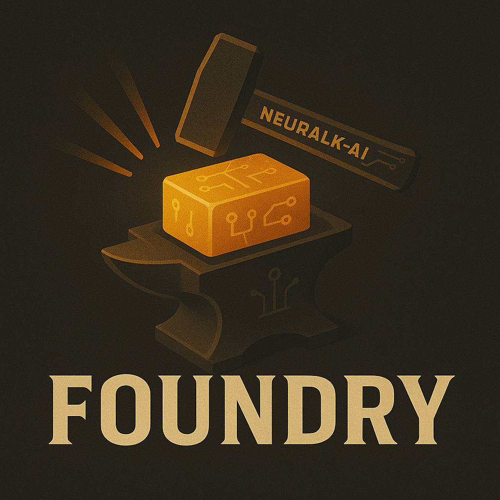

Introduction
============

**Neuralk Foundry** is a lightweight yet powerful framework for building modular machine learning pipelines — particularly well-suited for industrial tasks and representation learning. Whether you're prototyping or scaling up, Foundry helps you build, combine, and orchestrate steps cleanly and efficiently.

Foundry is also the engine behind [**TabBench**](https://github.com/Neuralk-AI/TabBench), Neuralk's internal benchmark for evaluating ML models on real-world tabular datasets.

.. grid::

    .. grid-item-card:: Getting started
        :link: https://github.com/Neuralk-AI/NeuralkFoundry-CE/

        Getting started with NeuralkFoundry-CE.

    .. grid-item-card:: Tutorial
        :link: https://github.com/Neuralk-AI/NeuralkFoundry-CE/tutorials/

        Basic use of NeuralkFoundry-CE

    .. grid-item-card:: API Reference
        :link: api/index
        :link-type: doc

        Neuralk Foundry API reference.

.. toctree::
    :maxdepth: 3
    :hidden:

    API Reference <api/index>
